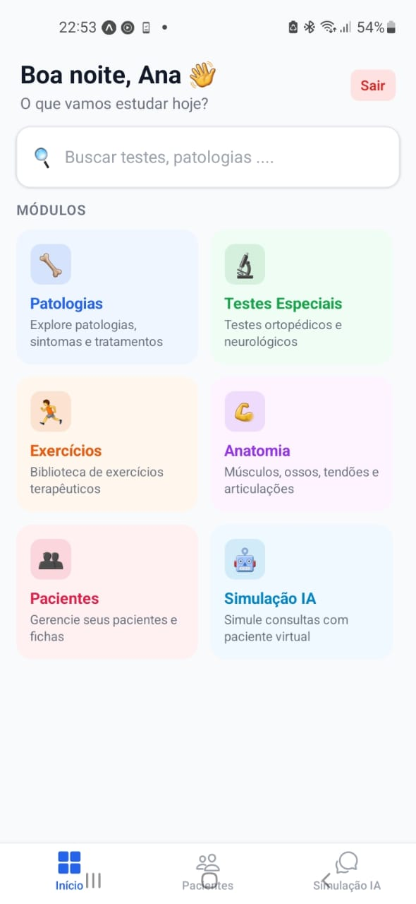
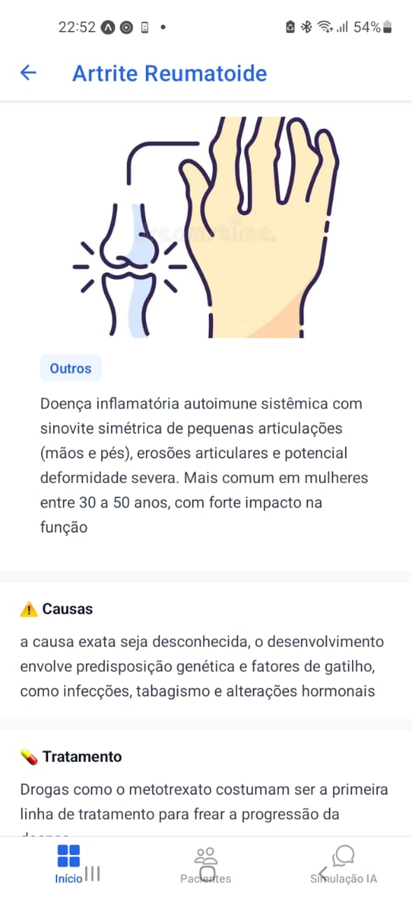
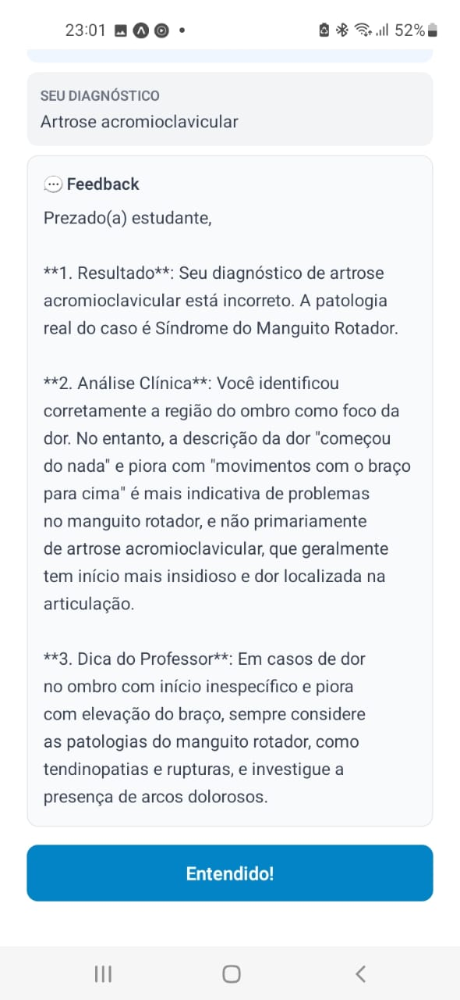

# 🦴 FisioApp

Plataforma de estudos e gestão clínica para fisioterapeutas, desenvolvida com Django REST Framework no backend e React Native com Expo no frontend, com integração de Inteligência Artificial com a do  Google Gemini.

---

## 📱 Screenshots




---

## 🚀 Funcionalidades

### 📚 Conteúdo Clínico
- **Patologias** — Descrição, causas, tratamento, sintomas em chips, testes e exercícios relacionados com navegação direta
- **Testes Especiais** — descrição detalhada, como realizar, achados positivos/negativos, sensibilidade e especificidade
- **Exercícios** — biblioteca terapêutica com nível, categoria, séries, repetições e músculo alvo
- **Anatomia** — 5 categorias: músculos, tendões, ligamentos, ossos e articulações, com origem, inserção, função e inervação
- Busca e filtros por região/categoria em todos os módulos
- Imagens armazenadas via **Cloudinary CDN**

### 👥 Gestão de Pacientes
- Cadastro completo com dados pessoais e contato
- **Ficha de anamnese** clínica — queixa principal, história da doença, avaliação da dor (escala 0-10), antecedentes, hábitos, dados clínicos (IMC calculado automaticamente)
- **Histórico de sessões** — registro de procedimentos, evolução e intensidade de dor por sessão

### 🤖 Simulação de Consulta com IA
- Sistema sorteia uma **patologia aleatória** do banco — o fisioterapeuta não sabe qual é
- **3 níveis de dificuldade**: Fácil, Médio e Difícil
- **Google Gemini** simula um paciente
- Fisioterapeuta vai conversando livremente via chat
- Ao submeter o diagnóstico, a IA avalia com **feedback pedagógico estruturado** em 3 tópicos:
  - Resultado (acertou, errou ou ficou próximo)
  - Análise Clínica (o que identificou corretamente e o que deixou passar)
  - Dica do Professor (orientação clínica sobre a patologia)

---

## 🛠️ Stack Tecnológica

### Backend
| Tecnologia | Uso |
|---|---|
| Python 3.12 | Linguagem principal |
| Django 6 | Framework web |
| Django REST Framework | API REST |
| Simple JWT | Autenticação via tokens |
| django-cors-headers | CORS para o app mobile |
| Cloudinary | Armazenamento de imagens em nuvem |
| Google Gemini 2.0 Flash | IA para simulação de pacientes e avaliação de diagnósticos |
| PostgreSQL | Banco de dados (produção) |
| SQLite | Banco de dados (desenvolvimento) |

### Frontend
| Tecnologia | Uso |
|---|---|
| React Native | Framework mobile multiplataforma |
| Expo SDK 54 | Toolchain de desenvolvimento |
| React Navigation | Navegação entre telas |
| Axios | Requisições HTTP |
| AsyncStorage | Persistência local do token JWT |

---

## 📁 Estrutura do Projeto

```
fisio-app/
├── apps/
│   ├── users/          
│   ├── patologias/     
│   ├── testes/        
│   ├── exercicios/     
│   ├── anatomia/     
│   ├── pacientes/     
│   └── consulta_ia/   
├── core/             
├── mobile/            
│   └── src/
│       ├── screens/    
│       ├── components/ 
│       ├── services/  
│       ├── context/   
│       └── routes/     
└── requirements.txt
```

---

## ⚙️ Como rodar localmente

### Pré-requisitos
- Python 3.12+
- Node.js 18+
- Expo Go instalado no celular
- Conta no [Cloudinary](https://cloudinary.com) (de graça)
- Chave da API do [Google Gemini](https://aistudio.google.com)

### Backend

```bash
# Clone o repositório
git clone https://github.com/danieldonizeti/fisio-app
cd fisio-app

# Crie e ative o ambiente virtual
python -m venv venv
venv\Scripts\activate  # Windows
source venv/bin/activate  # Linux/Mac

# Instale as dependências
pip install -r requirements.txt

# Configure as variáveis de ambiente
cp .env.example .env
# Edite o .env com suas chaves

# Rode as migrations
python manage.py migrate

# Crie um superusuário
python manage.py createsuperuser

# Inicie o servidor
python manage.py runserver 0.0.0.0:8000
```

### Frontend

```bash
cd mobile

# Instale as dependências
npm install --legacy-peer-deps

# Arrume a URL da API
# Edite src/services/api.js com o IP da sua máquina

# Inicie o Expo
npx expo start
```

Escaneie o QR code com o **Expo Go** no celular.

---

## 🔐 Variáveis de Ambiente

Crie um arquivo `.env` na raiz do projeto com base no `.env.example`:

```env
SECRET_KEY=sua-chave-secreta-django
GEMINI_API_KEY=sua-chave-gemini
CLOUDINARY_CLOUD_NAME=seu-cloud-name
CLOUDINARY_API_KEY=sua-api-key-cloudinary
CLOUDINARY_API_SECRET=seu-api-secret-cloudinary
```

---

## 📊 Módulos da API

| Endpoint | Descrição |
|---|---|
| `POST /api/auth/login/` | Autenticação JWT |
| `POST /api/users/` | Cadastro de usuário |
| `GET /api/users/me/` | Perfil do usuário logado |
| `GET /api/patologias/` | Lista de patologias |
| `GET /api/patologias/{id}/` | Detalhe com testes e exercícios |
| `GET /api/teste/` | Lista de testes especiais |
| `GET /api/exercicios/` | Lista de exercícios |
| `GET /api/anatomia/musculos/` | Lista de músculos |
| `GET /api/anatomia/tendoes/` | Lista de tendões |
| `GET /api/anatomia/ligamentos/` | Lista de ligamentos |
| `GET /api/anatomia/ossos/` | Lista de ossos |
| `GET /api/anatomia/articulacoes/` | Lista de articulações |
| `GET /api/pacientes/` | Lista de pacientes do fisioterapeuta |
| `POST /api/pacientes/{id}/anamnese/` | Criar/atualizar anamnese |
| `POST /api/pacientes/{id}/sessoes/` | Registrar sessão |
| `GET /api/consulta-ia/patologia-aleatoria/` | Sorteia uma patologia |
| `POST /api/consulta-ia/` | Criar simulação |
| `POST /api/consulta-ia/{id}/enviar-mensagem/` | Chat com paciente virtual |
| `POST /api/consulta-ia/{id}/submeter-diagnostico/` | Avaliar diagnóstico com IA |

---

## Agumas das proximas 

- [ ] Imagens em todos os módulos (patologias, testes, exercícios, anatomia)
- [ ] Módulo de IA Diagnóstica — descreve o paciente e a IA sugere diagnósticos prováveis
- [ ] IA sugerindo patologias prováveis através de uma  anamnese
- [ ] Histórico de simulações com estatísticas de acertos e evolução
- [ ] Deploy

---

## 👨‍💻 Autor

**Daniel Donizeti**